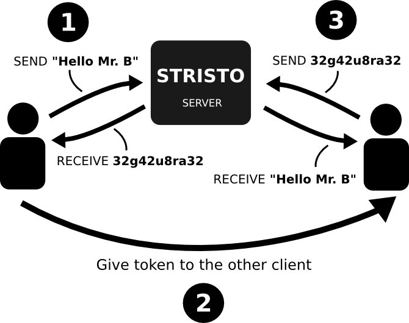

**Build status**
(dev-0.1) 

---

### Hand over token once, communicate forever...

---

### Setup

#### Docker

    docker run -d -p {PORT}:5050 stristo/stristo:0.1-dev

Stristo is now (after ca. 5 seconds) available to receive or send messages.
Substitute {PORT} with whatever port number you would like to free for stristo on your host machine.

#### Build from source

##### Requirements

- Couchdb Server
- Python 2.7
- Gunicorn (WSGI)

##### Run

1. Download the sourcecode from the latest release of stristo.

...then try...

    chmod +x run.sh
    ./run.sh &

Stristo should be running on port 5050 now.
If that didn't work out for you...

1. Manually run your couchdb server
2. Run stristo wit gunicorn (substitute {PORT} with a port number of your choice)

    gunicorn -b localhost:{PORT} stristo:app

Finally, run the application test with

    python ./stristo_test.py

### Usage

#### HTTP ReST API

Send a message to stristo by sending a GET request to:

    {HOST}:{PORT}/write/{MESSAGE}

You receive a **token**. With this token you can either write more messages to the same stack

    {HOST}:{PORT}/write/{TOKEN}/{MESSAGE}

read the latest message from the stack

    {HOST}:{PORT}/read/{TOKEN}

read the latest *n* messages from the stack

    {HOST}:{PORT}/read/{TOKEN}/{n}

read the latest *n* messages from the stack and get some additional information with it

    {HOST}:{PORT}/readfull/{TOKEN}/{n}

### Featuring

